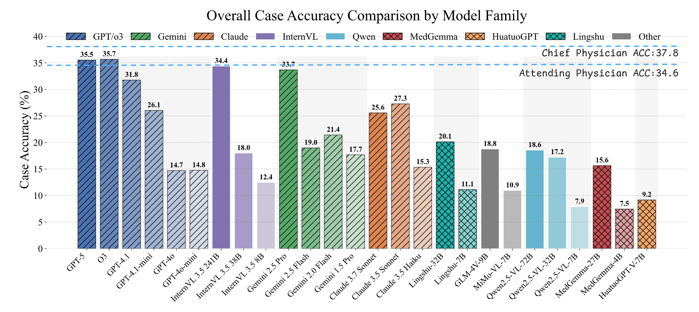

# [ICLR'26] LiveClin: A Live Clinical Benchmark

<p align="center">
   📃 <a href="https://arxiv.org/abs/2602.16747" target="_blank">Paper</a> &bull;
   🤗 <a href="https://huggingface.co/datasets/AQ-MedAI/LiveClin" target="_blank">Dataset</a> &bull;
   💻 <a href="https://github.com/AQ-MedAI/LiveClin" target="_blank">Code</a>
</p>


- LiveClin is a contamination-free, biannually updated clinical benchmark for evaluating large vision-language models on realistic, **multi-stage clinical case reasoning** with medical images and tables. 
- Each case presents a clinical scenario followed by a sequence of multiple-choice questions (MCQs) that mirror the progressive diagnostic workflow a clinician would follow — from initial presentation through diagnosis, treatment, complication management, and follow-up. 


## Updates 🔔

* **[2026.02.27]** Evaluation framework refactored.
* **[2026.02.21]** [Paper](https://arxiv.org/abs/2602.16747) released.
* **[2026.02.15]** LiveClin is published!


## Project Structure 🏗️

<details>
<summary><b>Click to expand</b></summary>

```
LiveClin/
├── evaluate.py                    # CLI entry-point
├── liveclin/                      # Core package
│   ├── __init__.py                #   EvalConfig dataclass
│   ├── client.py                  #   Async API client (shared connection pool)
│   ├── runner.py                  #   Multi-turn evaluation engine
│   ├── analyzer.py                #   Fine-grained results analysis
│   ├── data.py                    #   HuggingFace download & JSONL loading
│   └── utils.py                   #   Prompt formatting & answer extraction
├── scripts/
│   ├── serve_sglang.py            # SGLang deployment helper
│   └── test_vision.py             # Vision capability smoke test
├── requirements.txt
└── README.md
```

</details>

## Main Results 📊

<details>
<summary><b>Overall case accuracy, showing models grouped by family and ordered reverse chronologically</b></summary>

Bar textures indicate model type and dashed lines represent physician reference levels.



</details>

## Data Example 🩺

<details>
<summary><b>An example simulating the entire clinical pathway</b></summary>

The case progresses from initial assessment to long-term management, with new clinical information and diverse imaging modalities (e.g., X-ray, MRI, pathology, CT) progressively introduced at each key decision point.


</details>

## Quick Start 🚀

### 1. Install

```bash
git clone https://github.com/AQ-MedAI/LiveClin.git
cd LiveClin
pip install -r requirements.txt
```

### 2. Evaluate

A single command downloads the dataset (on first run) and runs the full pipeline:

```bash
# Remote API — images sent as URLs
python evaluate.py \
    --model gpt-5 \
    --api-base https://api.openai.com/v1 \
    --api-key sk-xxx \
    --image-mode url
```

For locally-served models (e.g. via SGLang), `--api-key` can be omitted:

```bash
python evaluate.py \
    --model Qwen2.5-VL-7B-Instruct \
    --api-base http://localhost:8000/v1 \
    --image-mode local
```

The evaluation pipeline will:
1. Auto-download the dataset from [HuggingFace](https://huggingface.co/datasets/AQ-MedAI/LiveClin) (only the requested config, cached for future runs)
2. Evaluate all cases concurrently via multi-turn conversation
3. Print a structured summary to the terminal
4. Save detailed results with fine-grained analysis to JSON

**Example terminal output**:

```
============================================================
  LiveClin Results: GPT-5 (2025_H1)
============================================================
  Question Accuracy:  5179/6605 (78.4%)
  Case Accuracy:      433/1407 (30.8%)
------------------------------------------------------------
  By Chapter (Top-5 Case Accuracy):
    Chapter 4: Endocrine, nutritional ...     ( 79 cases)  C-Acc 45.6%  Q-Acc 83.3%
    Chapter 12: Diseases of the skin ...      ( 40 cases)  C-Acc 45.0%  Q-Acc 81.7%
    ...
  By Chapter (Bottom-5 Case Accuracy):
    Chapter 14: Diseases of the geni...       ( 80 cases)  C-Acc 22.5%  Q-Acc 76.5%
    Chapter 11: Diseases of the dige...       (131 cases)  C-Acc 24.4%  Q-Acc 74.6%
    ...
------------------------------------------------------------
  By Subcategory (Top-5 Case Accuracy):
    Mental disorders due to substance...      ( 10 cases)  C-Acc 60.0%  Q-Acc 89.1%
    Dermatitis and eczema (L20-L30)           ( 10 cases)  C-Acc 60.0%  Q-Acc 84.8%
    ...
  By Subcategory (Bottom-5 Case Accuracy):
    Glomerular diseases (N00-N08)             ( 20 cases)  C-Acc 10.0%  Q-Acc 72.3%
    Renal tubulo-interstitial diseases...     ( 20 cases)  C-Acc 15.0%  Q-Acc 73.1%
    ...
------------------------------------------------------------
  By Rarity:
    Rare         (1181 cases)  Q-Acc 78.5%  C-Acc 31.0%
    Unrare       ( 226 cases)  Q-Acc 78.0%  C-Acc 29.6%
------------------------------------------------------------
  By Clinical Stage:
    Presentation & Assessment      (1618 MCQs)  Q-Acc 77.8%
    Diagnosis & Interpretation     (2168 MCQs)  Q-Acc 75.0%
    Therapeutic Strategy           (1601 MCQs)  Q-Acc 83.6%
    Complication Management        ( 184 MCQs)  Q-Acc 76.1%
    Follow-up                      ( 391 MCQs)  Q-Acc 86.2%
------------------------------------------------------------
  By Question Position:
    Q1     (1407 MCQs)  Q-Acc 78.5%  Err 0.1%
    Q2     (1407 MCQs)  Q-Acc 76.5%  Err 0.4%
    ...
------------------------------------------------------------
  By Image Modality:
    CT                   ( 832 MCQs)  Q-Acc 76.4%
    MRI                  ( 621 MCQs)  Q-Acc 78.2%
    Clinical Photo       ( 504 MCQs)  Q-Acc 74.1%
    ...
------------------------------------------------------------
  By Table Modality:
    Lab Results          (1023 MCQs)  Q-Acc 79.8%
    Medications          ( 412 MCQs)  Q-Acc 82.3%
    ...
============================================================
```

</details>

### 3. Test Vision (Optional)

Verify the model can perceive images before running a full evaluation:

```bash
# Remote API
python scripts/test_vision.py \
    --model gpt-5 \
    --api-base https://api.openai.com/v1 \
    --api-key sk-xxx

# Local deployment (--api-key can be omitted)
python scripts/test_vision.py \
    --model your-model \
    --api-base http://localhost:8000/v1
```

### 4. Self-Hosted Models (Optional)

Deploy your own model with [SGLang](https://github.com/sgl-project/sglang) to expose an OpenAI-compatible API:

```bash
# Terminal 1 — launch the model server
python scripts/serve_sglang.py \
    --model-path /path/to/your-model \
    --tp 2 --dp 4 --port 8000

# Terminal 2 — run evaluation
python evaluate.py \
    --model your-model-name \
    --api-base http://localhost:8000/v1 \
    --image-mode local
```

## CLI Reference ⚙️

| Flag            | Description                              | Default   |
| --------------- | ---------------------------------------- | --------- |
| `--model`       | Model identifier (required)              | —         |
| `--api-base`    | API base URL (required)                  | —         |
| `--api-key`     | API key (omit for local deployments)     | `token`   |
| `--image-mode`  | `url` or `local` (required)              | —         |
| `--dataset`     | Dataset config name                      | `2025_H1` |
| `--concurrency` | Max concurrent case evaluations          | `100`     |
| `--output`      | Output JSON path                         | auto      |
| `--resume`      | Resume and retry failed cases            | off       |
| `--max-retries` | Max retries per API call                 | `5`       |
| `--temperature` | Sampling temperature                     | `0.0`     |
| `--max-tokens`  | Max tokens per response                  | `16384`   |
| `--verbose`     | Print per-MCQ retry details              | off       |
| `--data-dir`    | Root directory for auto-downloaded data  | `data`    |
| `--jsonl-path`  | Override: direct path to JSONL file      | —         |
| `--image-root`  | Override: direct path to image directory | —         |

## Data 📦

### Auto-Download (Default)

No extra steps needed. On first run, only the requested dataset config (e.g. `2025_H1`) is downloaded from HuggingFace and cached locally in `data/`.

### Manual Download

For offline use or shared storage, download the dataset yourself:

```bash
# Via git (requires git-lfs)
git lfs install
git clone https://huggingface.co/datasets/AQ-MedAI/LiveClin /path/to/liveclin-data

# Or via Python
python -c "from huggingface_hub import snapshot_download; snapshot_download('AQ-MedAI/LiveClin', repo_type='dataset', local_dir='/path/to/liveclin-data')"
```

Then point the evaluator to your local copy:

```bash
# Set the data root (auto-resolves internal structure)
python evaluate.py ... --data-dir /path/to/liveclin-data

# Or point directly to specific files (highest priority)
python evaluate.py ... --jsonl-path /path/to/2025_H1.jsonl --image-root /path/to/image/
```

**Path priority**: `--jsonl-path / --image-root` > `--data-dir` > default (`data/`).

### Load with `datasets`

```python
from datasets import load_dataset

ds = load_dataset("AQ-MedAI/LiveClin", "2025_H1", split="test")

case = ds[0]
fp = case["exam_creation"]["final_policy"]
print(fp["scenario"])
for mcq in fp["mcqs"]:
    print(f"[{mcq['stage']}] {mcq['question'][:80]}...")
    print(f"  Answer: {mcq['correct_answer']}")
```

## Retry & Resume 🔄

The framework applies a three-layer retry strategy for robust evaluation under unstable network conditions:

| Layer | Scope           | Behavior                                                                       |
| ----- | --------------- | ------------------------------------------------------------------------------ |
| API   | Single API call | Retries on timeout, connection error, rate limit, 5xx with exponential backoff |
| MCQ   | Single question | If all API retries fail, retries the whole question before abandoning the case |
| Run   | `--resume` flag | Re-runs only failed cases; successfully completed cases are preserved          |

```bash
# Resume after a run with transient failures
python evaluate.py --model gpt-5 --api-base ... --api-key ... --image-mode url --resume
```

## Output Format 📄

Results are saved as a single JSON file (default: `results/<model>_<dataset>.json`):

```json
{
  "meta": {
    "model": "gpt-5",
    "dataset": "2025_H1",
    "image_mode": "url",
    "started_at": "...",
    "finished_at": "..."
  },
  "summary": {
    "total_cases": 1407,
    "total_mcqs": 6605,
    "question_accuracy": ...,
    "case_accuracy": ...,
    "by_rarity":          { "rare": {...}, "unrare": {...} },
    "by_chapter":         { "Chapter 2: Neoplasms": {...}, ... },
    "by_subcategory":     { "Chapter 2: Neoplasms": { "Subcategory A": {...}, ... }, ... },
    "by_stage":           { "Presentation & Assessment": {...}, ... },
    "by_position":        { "Q1": {...}, "Q2": {...}, ... },
    "by_image_modality":  { "CT": {...}, "MRI": {...}, ... },
    "by_table_modality":  { "Lab Results": {...}, "Medications": {...}, ... }
  },
  "cases": [...]
}
```

### Analysis Dimensions

| Dimension              | Granularity  | Categories                                                                                                             |
| ---------------------- | ------------ | ---------------------------------------------------------------------------------------------------------------------- |
| **Rarity**             | 2 groups     | Rare (84%), Non-rare (16%)                                                                                             |
| **ICD-10 Chapter**     | 16 chapters  | Disease-system-level breakdown                                                                                         |
| **ICD-10 Subcategory** | 48 groups    | Nested under chapters — fine-grained ICD-10 category breakdown                                                         |
| **Clinical Stage**     | 5 categories | Presentation & Assessment, Diagnosis & Interpretation, Therapeutic Strategy, Complication Management, Follow-up        |
| **Question Position**  | Q1–Q6        | Accuracy and error rate by position within each case                                                                   |
| **Image Modality**     | 11 types     | X-ray, CT, MRI, Ultrasound, Clinical Photo, Endoscopy, Angiography, PET & SPECT, Pathology, Biosignals, Diagram & Plot |
| **Table Modality**     | 9 types      | Lab Results, Medications, Demographics, Monitoring, Literature, Genomics, Pathology & IHC, Procedures, Staging Systems |

## Citation 📝

If you find LiveClin useful, please cite:

```bibtex
@misc{wang2026liveclinliveclinicalbenchmark,
      title={LiveClin: A Live Clinical Benchmark without Leakage},
      author={Xidong Wang and Shuqi Guo and Yue Shen and Junying Chen and Jian Wang and Jinjie Gu and Ping Zhang and Lei Liu and Benyou Wang},
      year={2026},
      eprint={2602.16747},
      archivePrefix={arXiv},
      primaryClass={cs.LG},
      url={https://arxiv.org/abs/2602.16747},
}
```
